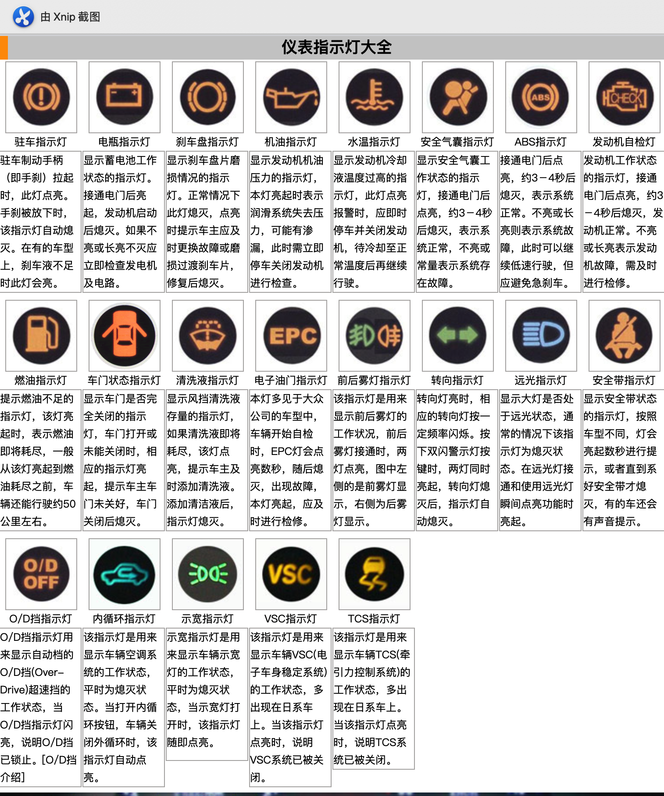

 

### 一、科一

包括: 机动车基本知识, 道路基本知识

QA: 机动车驾驶证和机动车驾驶许可有啥区别:  行驶证

#### 准驾驶车型: 

#### 1.1 驾驶证

机动车驾驶证共有16种: 大型客车的驾驶证为A1(>=20) 、牵引成为A2、城市公交车A3(10人以上)、中型客车的B1(10-19人)、大型货车B2、小型客车, 小型货车C1(座位数<=9), 小型自动挡汽车C2、低速载货汽车C3、三轮汽车C4、残疾车专用自动挡汽车为C5、普通三轮车是D、普通两轮摩托车为E、轻便摩托车是F(木兰)

#### 1.2驾驶证的申请条件:

- 年龄条件: 18-70周岁(C1、C2、C5、F) 、26-50周岁(大型客车A1)

- 身体条件: 4.9以上(0.8)、无红绿色盲、听力50c m可以辨别、肢体健全

- 禁止申请条件: 心脏病、癫痫病、戒毒3年内、发生事故逃逸的、酒后(20/100)或醉驾(80/100)发生事故,被追究刑事责任的、饮酒或醉酒被吊销驾照未满5年的、醉酒驾驶营运车未满10年的、因其他情形被吊销未满2年的(开报废车)、驾驶许可依法被撤销未满3年的(伪造驾驶证)

#### 1.3驾驶证管理

初次申请准驾车型

本市: A3、B2、C D E F M N P 

暂住: C D E F

驾驶人考试规定

1. 使用教练车、按照指定路线、指定时间学习
2. 道路交通法律法规和交通知识简称科目一、场地驾驶技能考试成为科目二、道路驾驶技能和安全文明驾驶知识成为科目三、每个科目考试一次(当场可以补考一次),在驾驶技能准考证明三年有效期内,科目2和科目3预约的次数不能超过5次 其他成绩作废

换证

1. 机动车驾驶证分为 6年、10年、长期三种, 

2. 驾驶证在有效期前90天内向驾驶证核发地车管所申请换证(每个积分周期未满12分), 换证时车管所对驾驶证进行审验(身体、驾驶违法情况)
3. 下面情形驾驶人应在30日内向核发地车管所换证: 
   - 机动车驾驶证记载的机动车驾驶人信息发生变化
   - 驾驶证损毁无法辨认的
   - 机动车驾驶人因服兵役、出境等无法在规定时间内办理换证的,可以向核发地车管所申请延期办理, 申请时要填写《机动车驾驶证申请表》,并提交身份证证明、机动车驾驶证、延期事由
   - 延期期限最多不超过3年,期间不能驾驶机动车

补征

原机动车驾驶证作废、驾驶证被扣留的不能申请补发、隐瞒有关情况提供虚假材料的,申请人一年内不等再次申请机动车驾驶证、申请人在考试过程中作弊取消考试资格,以考的成绩作废,申请人在一年之内不得再次申领机动车驾驶证、靠作弊获取到驾驶证,公安机关交通管理部门收缴驾驶证,撤销驾驶许可,申请人3年之内不得再次申领驾驶证

### 实习期

12个月为实习期,  实习期挂统一实习标志

实习期间不得驾驶公共汽车、运营客车、警车等、

上高速行驶,必须要有3年以上的驾驶人陪同

实习期间记满12分的,注销驾驶资格(注销最高准驾驶资格)、持有A1、A2、A3 B2 记6分以上实习期延长1年

#### 驾驶证的审验

发生交通事故,造成人员伤亡未被吊销机动车驾驶证的在记分周期结束后30日内向交通管理部门接受审验,在接受审验时要参加不少于3小时的法律法规、安全文明驾驶、交通安全事故案例教育

对交通违法行为未处理完毕,身体条件不允许的、为参加学习考试的、不予通过审验

#### 驾驶证的注销

实习期记满12分的,注销驾驶证

死亡、主动提出注销的、丧失民事行为能力的监护人提出注销的、身体条件不适合驾驶、精神病、心脏病等的,被查出吸毒的、超过驾驶证有效期1年以上未换证的、年领在60周岁以上未提交身体证明的、或者年龄在70周岁以上,所持有的驾驶证只具有低速载货、三轮汽车的、

#### 驾驶证累计记分

行政处罚和扣分,一次有2个以上违法行为的分别计算、累加分值, 

一次积分的分值为: 12分、6分、3分、2分、1分五种
一次积分周期未满12分,罚款以缴纳的积分予以清除、记分未满12分,但还有罚款没有缴纳的,记分转入下一个记分周期、达到12分的,公安机关交通管理部门扣留驾驶证

扣满12分,在15日内去驾驶证核发地或者交通管理部参加为期7天的学习和考试,可是合格记分予以清除,考试不合格继续学习考试 , 如果拒绝参加学习的交通管理部门将公告其驾驶证停止使用

 一个周期扣满24分的,考试合格后、交通管理部门在10日内对其进行道路驾驶技能考试

#### 一次记12分

- 驾驶与准驾车型不符
- 饮酒后驾驶机动车
- 造成交通事故后逃逸,尚不构成犯罪的
- 未悬挂车牌、故意遮挡、污损、不按规定安装车牌的
- 使用伪造、变招的驾驶车牌,伪造驾驶证,行驶证
- 高速路上倒车、逆行、穿越中央分隔带掉的
- 超过规定时速50%的

#### 一次6分

- 驾驶证被暂扣期间驾驶机动车
- 违反交通信号灯
- 超载超过30%或者违反规定载客的
- 高速公路停车的
- 占用高速公路或者城市快速路上占用应急车到的
- 低能见度高速公路不按规定行驶的
- 以隐瞒、欺骗手段补领驾驶证的
- 连续驾驶机动车超过4小时未停车休息小于20分钟的
- 机动车不避让校车的

#### 一次记3分的

1. 校车以外的超载人数未达20%  超速未达20%
2. 驾驶营运车，不包括公共汽车
3. 超载货物未达30%
4. 高速公路行驶低于规定最低时速的
5. 驾驶禁止驶入高速公路机动车的
6. 驾驶机动车在高速公路或者城市快速路上不按规定道路行驶的
7. 人行横道不避让行人、减速的、违法禁令标线、指士的
8. 不按规定超车、让行、逆行的（一般路）
9. 驾驶机动车违反规定牵引车的
10. 汽车故障后不按规定使用灯光、或警告标志的
11. 为安规定定期进行安全检验的

#### 一次记2分的

打电话，

#### 一次记1分的

1. 不按规定使用灯光的
2. 不按规定会车的
3. 驾驶机动车载货长度、宽度、高度超过规定的
4. 上路行驶机动车未放置检验合格证、保险标志、未随身携带行驶证、驾驶证的

### 机动车管理

1. 登记制度: 需要临时行驶的需要临时行驶证,号牌挂在规定位置,任何单位不得扣留号牌,包括注册登记(新车上路去所在地:号牌、行驶证、机动车登记证书)、转移登记(所有权变化的,30日内办理转移登记)、变更登记(车生颜色,更换发动机、更换车架、因质量问题更换整车运营机动车改为非运营机动车,机动车所有人的住所迁出或迁入交通部门管辖的)、抵押登记(可以像有关部门登记即ke)、注销登记(直接交给报废企业,报废企业处理之后会和交通部门办理的)
2. 机动车检验制度:更具法规定期参加安全技术检验 
机动车强制报废制度
3. 第三者责任强制保险制度:(交强险):强制性、减少矛盾、促进社会和谐

### 交通信号

1. 交通信号灯(其中包括非机动车信号灯):绿灯亮:转弯的车辆不得妨碍放行的车辆、行人通行、黄灯亮越过停止线的可以继续通行,
   红灯亮时右转弯的车辆在不妨碍执行车的情况下可以拐弯是不是对面是绿灯的不准左转弯了
 行人幸好灯:内有绿色行人标志的:
方向指示灯: 
黄灯闪硕的时候是不是行人和汽车全可以通过了
道路与铁路平交通信号灯: 两个红灯交替闪硕或者一个红灯亮时静止行人通行

道路交通标志: 警告标志黄底黑字
连续下坡路段、窄桥标志、双向交通标志、(查询所有警告标志)、行人标志、牲口标志、野生动物标志、信号灯标志、注意横风标志、易滑标志
叉形符号:前方有多股铁路与道路相交、一道横斜杠50m、事故亦发路段、建议速度(不是强制的)、
禁令标志:红底白字、禁止驶入、禁止机动车驶入、禁止超车、限速标志,解除限速标志
指士标志: 指准直行、立交直行和左转、环岛标志、鸣喇叭标志,必须喇叭、路口优先标志

指路标志: 预告前方的路,
道路编号: 国道,省道,乡道,

高速公路为绿色的指路标志:

道路交通标线:1.指示表线: 中间黄色虚线(不同方向 可以超车,掉头)、白色虚线(同方向) 、左转弯代转曲线(在里面红灯也可以转吗?)、

转弯线白色一般在左边走,黄色一般在右侧行走,用于指使,全是虚线
白色菱形,人行车道预告

出入口标线

停车位标线

港湾式停靠标线: (虚线进,虚线出)
导向箭头:严格按照指使进行,(白箭头)

### 罚款情形

200-2000

1. 未取得机动车驾驶证、或者暂扣驾驶机动车
2. 将机动车给了未取得的人
3. 造成交通事故后逃逸，尚没有犯罪
4. 超50%速度
5. 强迫别人违法得

### 交通肇事

1. 酒后，吸毒驾驶
2. 无驾驶资格驾驶
3. 明知安全装置失灵
4. 明知无牌证或者报废的车辆
5. 严重超载驾驶的
6. 逃离事故现场的

### 其他

1. 两条车道：60、100， 三条车道：60，90，90， 100
2. 30 40， 50 70
3. 261  145  520
4. 假一吊二撤三醉五
5. 高速公路规定：时速超过100公里，车距100米以上，时速低于100，车距50米
6. 6年10年终身，有效期
7.  wei 逃逸3年以下， 逃逸3到7， 逃逸死7年以上
8. 未带驾驶证、号牌，检验标志，保险标志，行驶证 会扣车
9. 满12分，交警扣驾驶证，考试通过再拿回来
10. 换证才会审验，记分满12分不会审验，直接就让考试了
11. 审验包括：安全违法行为，交通事故处理；身体；记满12分考试情况
12. 只有没有路灯和照明的情况下才会用远光灯
13. 危险驾驶罪：醉驾，追逐竟驾驶，
14. C1可以驾驶自动当汽车，三轮，再活汽车
15. 在高速公路或者快速路以为不记安全带，不扣分
16. 两个凸是不平，一个是高突，一个坑是低洼，空的是桥
17. 黄高白低黑建议
18. 三角形减速让行，8角形停车让行

https://haokan.baidu.com/v?pd=wisenatural&vid=11801840724321034998

### 参考地址

http://auto.sohu.com/s2006/ybzsd/

